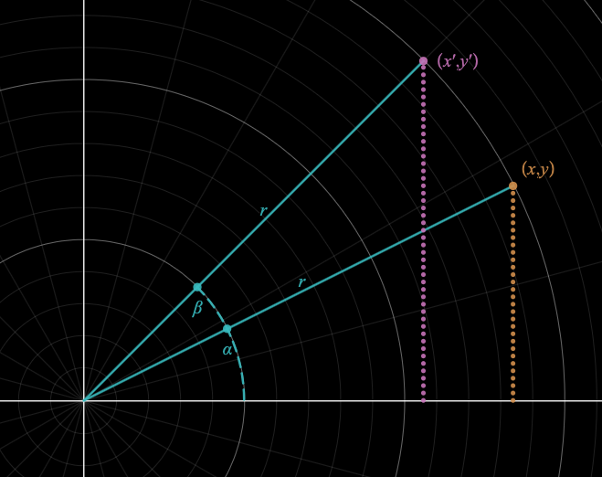

# Cube

<p align="center">
    
</p>

Modified: 2021-04

This is a demonstration of using 2 dimensional cartesian and trigonometric analysis to render computer graphics in 3D space.
## Quickstart
Install node packages. I am using `parcel` to render the static page and perform typescript transpilation:
```bash
npm i
```
Start the server:
```bash
npm run serve 
```

## Theory

In the 2D (x,y) plane the goal is to represent translated coordinates (x',y') as a function of initial coordinates (x,y) at any angle  after some angular rotation  :<br>


### Forumulation
We start with rotation about the z axis (xy plane). From the diagram we can write x and y as a function of the angle  :<br> 
<br>
<br>

x' and y' can also be represented in the same way except as a function of  which can be rewritten using known identities:<br>
<br>
<br>
<br>
<br>

Finally substituting r for our x and y equations:<br>
<br>
<br>

We can apply the same proof for rotating about other axis' by replacing the static coordinate.<br>
Rotation about x axis:<br>
<br>
<br>
Rotation about y axis:<br>
<br>
<br>